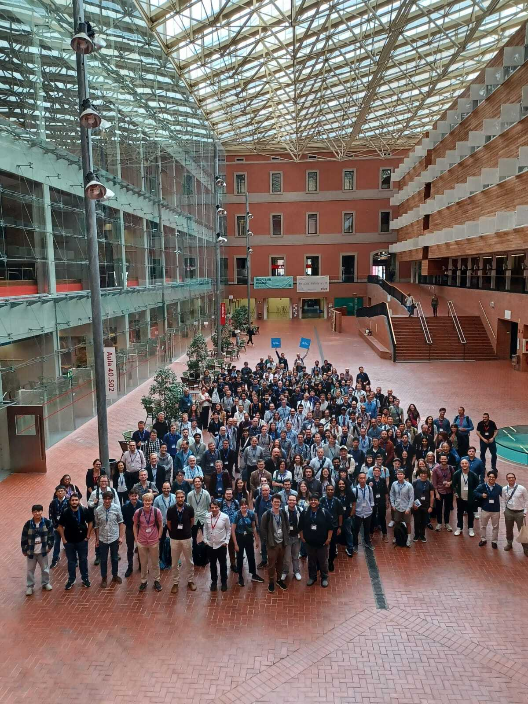
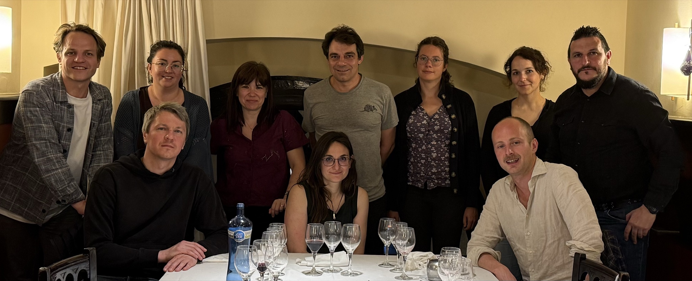
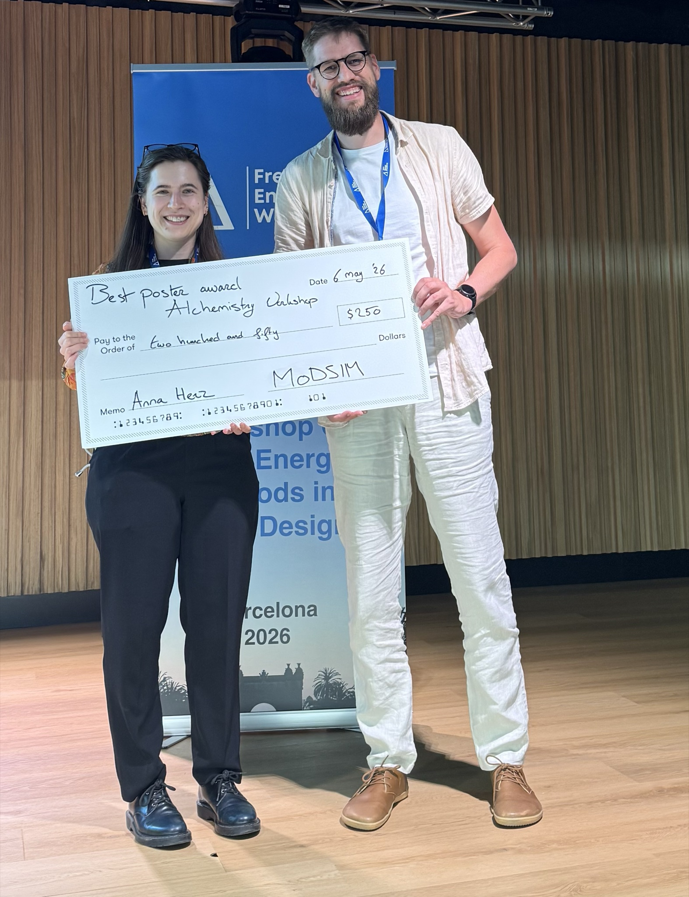
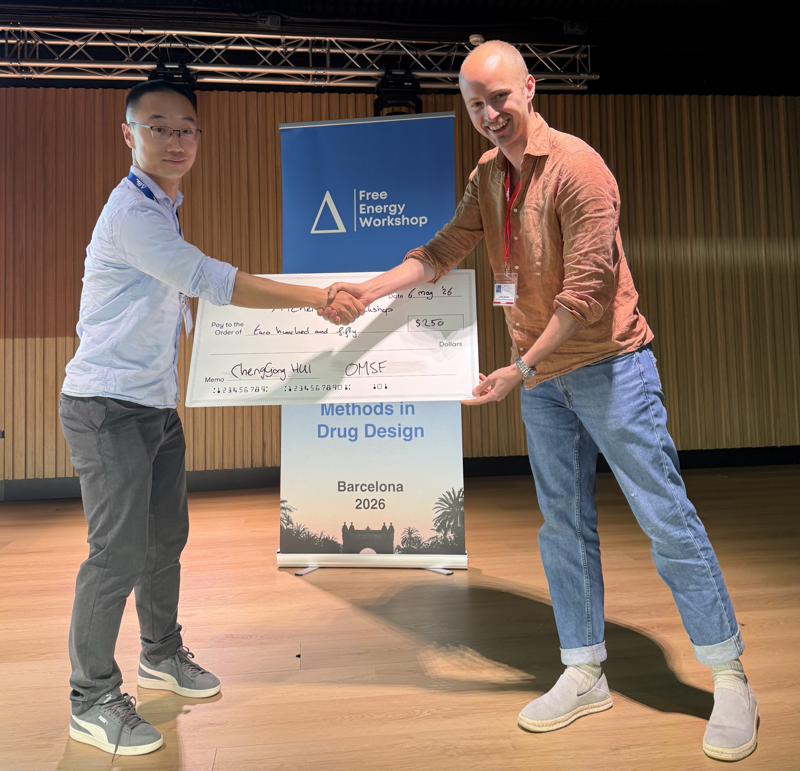

# Description
The 2026 Free Energy Workshop, hosted by the Alchemistry Organization Committee and the OMSF, took place from May 4-6th at the Auditorium of the Universitat Pompeu Fabra (UPF) on the Ciutadella campus in Barcelona, Spain. The workshop focuses on free energy methods in computational chemistry and drug design and welcomed researchers from around the globe.

## Group Photo

# Organization Committee
* [Dr. Jordi Juárez-Jiménez](https://www.linkedin.com/in/jordi-ju%C3%A1rez-jim%C3%A9nez-45a20961/) — University of Barcelona
* [Dr. Salomé Llabrés](https://www.linkedin.com/in/salom%C3%A9-llabr%C3%A9s-prat/) — University of Barcelona
* [Dr. Carolina Estarellas](https://www.linkedin.com/in/carolina-estarellas-3339a2168/) — University of Barcelona
* [Dr. Dmitry Lupyan](https://www.linkedin.com/in/dmitry-lupyan-9980468/) — Schrödinger
* [Dr. Jenke Scheen](https://www.linkedin.com/in/jenkescheen/) — Open Molecular Software Foundation
* [Pablo Navarro](https://www.linkedin.com/in/pablo-navarro-acero-72bba4163/) — Ph.D. Candidate, NostrumBioDiscovery
* [Dr. Tatjana Braun](https://www.linkedin.com/in/tatjana-braun-32183a165/) — Schrödinger
* [Dr. Vytas Gapsys](http://www.linkedin.com/in/vytautas-gapsys) — Johnson & Johnson
* [Dr. Bert de Groot](https://www3.mpibpc.mpg.de/groups/de_groot/index.html) — Max Planck Institute for Multidisciplinary Sciences
* [Dr. Alzbeta Kubincova](https://www.linkedin.com/in/al%C5%BEbeta-kubincov%C3%A1/) — University of California Irvine
* [Aakankschit (AK) Nandkeolyar](https://www.linkedin.com/in/aakankschit-nandkeolyar-838b0b126/) — Ph.D. Candidate, University of California Irvine

## Organizer's Photo

# Keynote Speakers

| Pat Walters | Jon Essex |
|---------------|---------------------|
| **Institution:** Chief Scientist, OpenADMET | **Institution:** Professor, University of Southampton |
| **Title:** *"AI in Drug Discovery - Revolution, Evolution, or Complete Nonsense?"* | **Title:** *"Grand Canonical Simulation Methods in Structure-Based Drug Design"* |
| **Video:** [YouTube](https://www.youtube.com/@the-Free-Energy-Workshop) | **Video:** [YouTube](https://www.youtube.com/@the-Free-Energy-Workshop) |

# Invited Speakers

| **Speaker**              | **Affiliation**                                             |
| ------------------------ | ----------------------------------------------------------- |
| Julien Michel            | OpenBioSim & University of Edinburgh                        |
| Haoyu Yu                 | Anew Therapeutics                                           |
| Marco Cecchini           | University of Strassbourg                                   |
| Joseph Bluck             | Bayer AG                                                    |
| Stephan Ehrlich          | UCB                                                         |
| Narjes Ansari            | Qubit Pharmaceuticals                                       |
| David Pearlman           | QSimulate                                                   |
| Domen Pregeljc           | ETH Zurich                                                  |
| Francesco Luigi Gervasio | University of Geneva                                        |
| Jonah Vilseck            | Indiana University School of Medicine                       |
| Hannah Baumann           | Open Free Energy                                            |
| Chris Neale              | OpenEye                                                     |
| Ramon Crehuet            | Institute for Advanced Chemistry of Catalonia (IQAC) - CSIC |
| Vincent Voelz            | Temple Uni                                                  |
| Vladimir Aladinskiy      | Insilico Medicine                                           |
| Willem Jespers           | Groningen University                                        |
| Robert Abel              | Schrodinger                                                 |
| Jasmin Guven             | University of Edinburgh                                     |

# Schedule

**Legend:** Keynote Speaker · Invited Speaker

---

## May 4th, 2026 (Day 1)

### Session 1: Advanced Sampling and Algorithmic Innovations
#### Session Chairs: Anna H Herz, Carolina Estarellas

| Time | Speaker | Title |
|------|---------|-------|
| 8:30 | | Attendee registration |
| 9:00 | | Welcome + Opening Remarks |
| 9:15 | Francesco Luigi Gervasio | When Collective Variables Fail: Innovative Solutions for Converging Free Energy Landscapes |
| 9:40 | Domen Pregeljc | Are Multiscale Simulations More Accurate Than Classical Alternatives? An Application to Atropisomerism and Development of a Multistate QM(ML)/MM Free-Energy Method |
| 10:05 | Avi Robinson-Mosher | Times Square sampling: a guided tour of an adaptive algorithm for free energy estimation |
| 10:30 | | *Break (30 min)* |

### Session 2: Advanced Sampling and Algorithmic Innovations
#### Session Chairs: Aleix Quintana, Carolina Estarellas

| Time | Speaker | Title |
|------|---------|-------|
| 11:00 | Justina Ratkeviciute | Improving Alchemical Binding Free Energy Calculations Using Fully Adaptive Simulated Tempering (FAST) |
| 11:25 | Adam Baskerville | Binding Free Energies from Following Ligands on the Way Out |
| 11:50 | Narjes Ansari | Lambda-ABF-OPES: A Robust Framework for Absolute and Relative Binding Free Energy Calculations |
| 12:15 | | FLASH POSTER PRESENTATIONS |
| 12:40 | | *Lunch (1h 30min)* |

### Session 3: Integrating Physics-Based Modeling and Machine Learning
#### Session Chairs: Ernestas Urniežius, Jenke Scheen

| Time | Speaker | Title |
|------|---------|-------|
| 14:10 | Pat Walters | AI in Drug Discovery - Revolution, Evolution, or Complete Nonsense? |
| 15:00 | Haoyu Yu | Learning the Thermodynamic Landscape of Protein-Ligand Interactions at Scale |
| 15:25 | Marco Cecchini | On the impact of AI technologies on virtual screening for drug discovery |
| 15:50 | | *Break (30 min)* |

### Session 4: Integrating Physics-Based Modeling and Machine Learning
#### Session Chairs: Emily Landwehr, Jenke Scheen

| Time | Speaker | Title |
|------|---------|-------|
| 16:20 | Márton Vass | No Structure? No Problem: Just Have Some TEA with FEP! |
| 16:45 | Michael Shirts | Mapping between Boltzmann distributions: from analytical to machine-learned mappings |
| 17:10 | Jasmin Guven | Methods for alchemical free energy calculations with betalactamase inhibitors |
| 17:35 | | *Poster session (1h 15min)\** |
| 18:50 | | End of the Day |
| 19:30 | | *Guided City Tour* |

---

## May 5th, 2026 (Day 2)

### Session 5: Proteins, Peptides & Novel Modalities
#### Session Chairs: Finlay Clark, Jordi Juárez-Jiménez

| Time | Speaker | Title |
|------|---------|-------|
| 8:30 | | Venue opens |
| 9:00 | | Attendee registration + Walk in |
| 9:00 | Julien Michel | Beyond small molecule–protein complexes: relative binding free energy calculations for diverse modalities |
| 9:25 | Luca Carlino | Dissociation Free Energy (DFE) Methodology for Identification of Novel Interfaces in Molecular Glue Applications |
| 9:50 | Patricia Blanco Gabella | Understanding the Role of H-Bonds in the Stability of Molecular Glue-Induced Ternary Complexes |
| 10:15 | | *Break (30 min)* |

### Session 6: Proteins, Peptides & Novel Modalities
#### Session Chairs: Sarah Stieglitz, Jordi Juárez-Jiménez

| Time | Speaker | Title |
|------|---------|-------|
| 10:45 | Raquel López-Ríos de Castro | Prediction of Protein–Protein binding free energy upon mutations using MLCG (Machine-Learned Coarse-Grained Model) |
| 11:10 | Hugo Gutiérrez de Terán | Accurate predictions of protein mutational effects with QresFEP |
| 11:35 | Laura Perez Benito | Large scale FEP for peptides |
| 12:00 | | FLASH POSTER PRESENTATIONS |
| 12:25 | | GROUP PICTURE |
| 12:40 | | *Lunch (1h 30min)* |

### Session 7: High-Throughput FEP and Scalable Workflows
#### Session Chairs: Varbina Ivanova, Dmitry Lupyan

| Time | Speaker | Title |
|------|---------|-------|
| 14:10 | Jonathan Essex | Grand Canonical Simulation Methods in Structure-Based Drug Design |
| 15:00 | Joshua Horton | Recent Advances in OpenFE: From Workflows to Multi-Method Alchemical Networks |
| 15:25 | Willem Jespers | Doing More with Less: Accurate and Scalable Ligand Free Energy Calculations by Focusing on the Binding Site |
| 15:50 | | *Break (30 min)* |

### Session 8: High-Throughput FEP and Scalable Workflows
#### Session Chairs: Chenggong Hui, Dmitry Lupyan

| Time | Speaker | Title |
|------|---------|-------|
| 16:20 | Mark Mackey | Low-cost high-throughput FEP using active learning with 3D features |
| 16:45 | Forrest York | High Throughput FEP With Local Sampling |
| 17:10 | Robert Abel | Advancing Candidate Optimization via Rigorous Free Energy Calculations: From Kinome-Wide Selectivity to Solid-State Properties |
| 17:35 | | *Poster session (1h 15min)\** |
| 18:50 | | End of the Day |
| 19:00 | | *Happy Hour by Schrödinger — "Blue Terrace" of the Sofitel Barcelona Skipper (Avenida del Litoral, 10)* |

---

## May 6th, 2026 (Day 3)

### Session 9: Industrial Applications and Development
#### Session Chairs: Alzbeta Kubincova, Salomé Llabrés

| Time | Speaker | Title |
|------|---------|-------|
| 8:30 | | Venue opens |
| 9:00 | | Attendee registration + Walk in |
| 9:00 | Joseph Bluck | The application of free energy methods at Bayer |
| 9:25 | Stephan Ehrlich | From pilot to practice: Embedding FEP into DMTA cycles for prospective decision-making at UCB |
| 9:50 | David Pearlman | Addressing Electronic Complexity in FEP: Scaling QM/MM and Physics-Informed ML for Predictive Lead Optimization |
| 10:15 | Kenneth Goossens | Scaling Physics-based methods with AI for Lysosomal P-type ATPase Discovery |
| 10:40 | | *Break (30 min)* |

### Session 10: High-Throughput FEP & Scalable Workflows
#### Session Chairs: Emily Landwehr, Salomé Llabrés

| Time | Speaker | Title |
|------|---------|-------|
| 11:10 | Vincent Voelz | Improved expanded ensemble methods for massively parallel virtual screening |
| 11:35 | Ramon Crehuet | Introducing NEMAT, a non-equilibrium method to calculate binding energies to membrane proteins |
| 12:00 | Jonah Vilseck | Scaling LaDyBUGS for Drug Discovery: Methodological Enhancements and Expanded Protein–Ligand Benchmarks |
| 12:25 | Chris Neale | Chimeric Atom Matching and Sampling Sufficiency as Determinants of RBFE Accuracy |
| 12:50 | | *CLOSING REMARKS + LUNCH* |

# Poster Sessions

📕 [**Download the Book of Abstracts (PDF)**](book_of_abstracts.pdf)

## Poster Session 1

| **Poster Number** | **Name** | **Affiliation** | **Title** |
|-------------------|----------|-----------------|-------|
| 1 | Albert Ortega Bartolomé | Institut de Química avançada de Catalunya (CSIC) | NEMAT: An Automated Non-Equilibrium Free-Energy Framework for Predicting Ligand Affinity in Membrane Proteins |
| 2 | Alexandre Blanco-González | MRC - Laboratory of Molecular Biology | Training a force field for proteins and small molecules from scratch |
| 3 | Alyssa Travitz | Open Free Energy, OMSF | Open Free Energy: An Ecosystem for Open Source Alchemy |
| 4 | Anna Katharina Picha | University of Vienna | Dual-coordinate Alchemical Transformations Using Machine-Learned Interatomic Potentials |
| 5 | Audrius Kalpokas | University of Edinburgh | Modelling Macrocyclic Peptide PCSK9 Inhibitors with Alchemical Free Energy Calculations |
| 6 | Benjamin Kaminow | Memorial Sloan Kettering Cancer Center | Exploring the relevance of structure-based machine learning in binding affinity predictions |
| 7 | Blanca Díaz Canals | Universitat de Barcelona | Molecular glues in drug design: enhancing protein-protein interaction stability for innovative cancer therapies |
| 8 | Charlie Holdship | University of Southampton | Computational Alanine Scanning of Conotoxin Peptides as a Route to Antitoxin Design |
| 9 | Chenggong Hui | Max Planck Institute for Multidisciplinary Sciences | Enhancing Relative Binding Free Energy Calculation with Grand Canonical Monte Carlo, Water Swap Monte Carlo, and Replica Exchange Solute Tempering |
| 10 | David De Sancho | University of the Basque Country | Decoding the Rules of Phase Separation through alchemical transformations on model peptides |
| 11 | David Dotson | Datryllic LLC | Efficient and fully automated large scale execution of alchemical campaigns with alchemiscale |
| 12 | David Sjöberg | Uppsala University | An Explainable and Uncertainty-Aware Bayesian Graph Neural Network for Predicting the effect of Protein mutations |
| 13 | Dominic Rufa | SandboxAQ | Nonequilibrium Chimeric Switching (NEX) for parallelizable Relative Binding Free Energy Calculations |
| 14 | Emily Landwehr | Indiana University School of Medicine | Exploration of alternative λ-networks in LaDyBUGS (λ-Dynamics with Bias Updated Gibbs Sampling) to optimize sampling efficiency |
| 15 | Enrico Ruijsenaars | ETH Zürich | Scalable Multistate Free Energy Calculations with automated Network Design |
| 16 | Fazil Safarov | Zuse Institute Berlin | Targeting Undruggable Proteins Using ISOKANN framework |
| 17 | Finlay Clark | Newcastle University | Fast training of Open Force Field valence parameters for free energy calculations |
| 18 | Gaetano Calabro | OpenEye Cadence Molecular Sciences | Fast Free Energy Prediction with FE-NES |
| 19 | Haolin Du | University of Edinburgh | Scaling Absolute Binding Free Energy Calculations for Virtual Screening |
| 20 | Hiroyuki Ogawa | Shionogi & Co., Ltd | In silico-driven protocol for hit-to-lead optimization: a case study on PDE9A inhibitors |
| 21 | Hyesu Jang | OpenEye, Cadence Molecular Sciences | Rational iterative structure-based drug design in Orion |
| 22 | Irfan Alibay | Open Free Energy, The Open Molecular Software Foundation | Exploring the sensitivity of relative binding free energy calculations to force field choices |
| 23 | Hannah Baumann | Open Free Energy (OMSF) | Exploring the sensitivity of alchemical methods to force field |
| 24 | Justina Ratkeviciute | University of Southampton | Improving Alchemical Binding Free Energy Calculations Using Fully Adaptive Simulated Tempering (FAST)|
| 25 | Lucas Mateos | Computational Biochemistry Unit (CINN/CSIC) | Structural characterization of cannabidiol and cannabigerol orthosteric and allosteric binding to the adenosine A3 receptor |
| 26 | Marc Schuh | BOKU Vienna | Scaling of non-bonded inter-molecular interactions improves convergence in the geometric route for protein-protein binding free energy calculations |
| 27 | Marco Klähn | AstraZeneca | Generative Active Learning for Molecular Design: Integrating Compound Synthesizability Prediction with Binding Affinity Optimization |
| 28 | Maria Cecilia Barrera | IMEC | Relative Binding Free Energy pipeline for G Protein Coupled Receptors |
| 29 | Mert Sagiroglugil | University of Barcelona | From Unbiased MD to Selectivity: Neural-Network Metastable State Discovery and MSM Kinetics for Bioorthogonal Analogs |
| 30 | Monica Barron | Indiana University School of Medicine | Comparing co-alchemical ion and analytic correction charge-changing perturbation strategies for modeling protein mutations in λ-dynamics |
| 31 | Nadine Grundschober | BOKU University | Site-directed mutagenesis applying A-EDS |
| 32 | Niu Huang | National Institute of Biological Sciences, Beijing | *-* |
| 33 | Oscar Diaz Sanzo | Nanomaterials and Nanotechnology Research Center (CINN-CSIC) | Rational design of novel pyrimidinone derivatives as dual A2A/A2B adenosine receptor antagonists |
| 34 | Parveen Gartan | Department of Chemistry, University of Bergen | Multisite λ Dynamics in Academic Drug Design Projects |
| 35 | Lindsey Whitmore | University of Colorado Boulder | Scalable, accurate, and adaptive free energy calculations for molecular design |
| 36 | Aleix Quintana | Universitat Autònoma de Barcelona | Non-equilibrium alchemical thermodynamic integration to calculate accurate free energy differences in biomolecular systems |

## Poster Session 2

| **Poster Number** | **Name** | **Affiliation** | **Title** |
|-------------------|----------|-----------------|-------|
| 37 | Donald van Pinxteren | Groningen University | Stabilizing Large Alchemical Perturbations in Relative Binding Free Energy Calculations |
| 38 | Shen Guo | Groningen University | QGPU: A GPU-Accelerated Molecular Dynamics Engine |
| 39 | David Alencar Araripe | Groningen University | Fast GPCR Ligand RBFE in All-Atom Lipid Bilayers |
| 40 | Remco L van den Broek | Leiden University | TACTICS: Bayesian Active Learning for Compound Prioritization in Ultra-Large Combinatorial Libraries Toward Free Energy Calculations |
| 41 | Mark Fonteyne | Leiden University | Validating peptide-probe unbinding with contact parallel cascade selection molecular dynamics (cPaCS-MD) for fluorescent-guided surgery |
| 42 | Wessel Porschen | Leiden University | An integrated residue and ligand free energy perturbation protocol for membrane proteins |
| 43 | Cheil Jespers | Leiden University | QmapFEP - A flexible infrastructure for high-throughput FEP calculations with spheric boundary conditions |
| 44 | Qinghua Liao | University of Barcelona | Applications for Alchemical Free Energy Calculations of Solvation, Binding and pKa in Complex Biomolecular Systems |
| 45 | Sara Tkaczyk | University of Vienna | Alchemical free energy calculations with neural network potentials |
| 46 | Sarah Stieglitz | Indiana University School of Medicine | Optimizing and Applying LaDyBUGS for Accurate Modeling of Protein-Peptide Binding Free Energies |
| 47 | Shu-Yu Chen | University of Basel | Smoother Alchemical Transformation via Enveloping Distribution Sampling for Free-Energy Estimation |
| 48 | Simon Webb | VeraChem LLC | Fast, accurate prediction of protein-ligand binding free energies by mining minima: the VM2 software package |
| 49 | Yutong Zhao | NVIDIA | Accelerating Molecular Dynamics |
| 50 | Zhao Chen | National Institute of Biological Sciences, Beijing | Exploring the Energetic Contributions of Halogen Atoms to Protein-Ligand Interactions |
| 51 | Pavel Buslaev | Astex Pharmaceuticals | Free Energy Calculations in Fragment-Based Drug Discovery: Learnings from Internal Validation Studies |
| 52 | Varbina Ivanova | University of Barcelona | TOWARDS ACCURATE BINDING MODE PREDICTION FOR FREE-ENERGY CALCULATIONS: DEVELOPMENT OF THE MULTIPLE-COPIES ASSOCIATION STUDIES (MAS) |
| 53 | Nithishwer Mouroug Anand | University of Southampton | Optimizing ABFE Workflows for applications to membrane proteins GPCRs |
| 54 | Aitor Valdivia | Universitat de Barcelona (UB) | Mining Druggable Sites in Influenza A Hemagglutinin: Binding of the Pinanamine-Based Inhibitor M090 |
| 55 | Anna M. Herz | Boehringer Ingelheim | Optimising Potency Predictions: When and How FEP Data Improves Machine Learning Models |
| 56 | Katerina Barmpidi | University of Barcelona | Decoding Isoform Selectivity in AMPK via Free Energy Calculations |
| 57 | Leon Persch | Johannes Gutenberg-University Mainz | Folding Free Energy Perturbation Reveals a Critical Role of the PGLE Motif in Vreteno ZNF Stability |
| 58 | Ivan Manoza | QMUL | Computational assay of hERG ion permeation, small-molecule modulation, and binding free energies |
| 59 | Ravy Leon Foun Lin | AUDENSIEL & Université Paris Cité | N-Glycosylation Dynamics and Conformational Free Energy Landscapes in Full-Length IgG2 & IgG4 Monoclonal Antibodies: An All-Atom Molecular Dynamics Investigation |
| 60 | Lorenzo Tulli | University of Bristol | Cancer-associated mutations reconfigure dynamical responses in EGFR kinase |
| 61 | Jasmin Güven | University of Bristol | Towards improved binding affinity calculations for metalloproteins with meze|
| 62 | Yuanqing Wang | New York University / University of Toronto | Estimator, the sampler, and the force field: These three are one |
| 63 | Matthew Burman | The Institute of Cancer Research | FEP protocols for real world potency optimisation |
| 64 | Aakash Davasam | Weill Cornell / Rockefeller University / Memorial Sloan Kettering Cancer Center | Does the membrane matter? Assessing the explicit membrane protocol in OpenFE |
| 65 | Icaro A. Simon | University of Copenhagen | Fast Screens or Rigorous Ranking? AI Cofolding Models versus Free Energy Perturbation for GLP-1 Variant Binding to GLP1R |
| 66 | Carter Wilson | Max Planck Institute for Multidisciplinary Sciences | Computational alchemy for studying protein covalent modifications |
| 67 | Alex Payne | Memorial Sloan Kettering Cancer Center | How many crystal structures do you need to trust your docking results? |
| 68 | BinQing Wei | Genentech | An AI Agent for Streamlining Binding Free Energy Calculations |
| 69 | Ernestas Urniežius | Vilnius University | From Binding Thermodynamics to Free Energy Prediction: Molecular Recognition in Carbonic Anhydrase–Sulfonamide Model Systems |
| 70 | Iván Pulido | Memorial Sloan Kettering Cancer Center | Nonequilibrium Alchemical Free Energy Calculations for Protein Mutations Using OpenFE: Application to ABL1 Binding Systems |
| 71 | Sukrit Singh | Memorial Sloan Kettering Cancer Center | More protein-ligand data are needed for AlphaFold-like models to enable drug discovery |
| 72 | Tatjana Braun | Schrodinger | Accurate in silico prediction of pH-dependent antibody binding affinities using robust physics-based methods |

# Poster Session Winners

| **Anna M. Herz** | **Chenggong Hui** |
|:---:|:---:|
| *"Optimising Potency Predictions: When and How FEP Data Improves Machine Learning Models"* | *"Enhancing Relative Binding Free Energy Calculation with Grand Canonical Monte Carlo, Water Swap Monte Carlo, and Replica Exchange Solute Tempering"* |
|  |  |
| *MODSIM Pharma-sponsored Poster Prize Awarded to Dr. Anna Herz by Dr. Willem Jespers* | *OMSF-sponsored Poster Prize Awarded to Dr. Chenggong Hui by Dr. Jenke Scheen* |

# We Thank Our Corporate Sponsors

  

  

  

  

  

  

  

  

  

  

  

  

  

  

  

  

   

   

   

   


<!-- TODO: add a UPF logo to archive/2026/logos/UPF.png, then move this block out of the
     comment (and out of the raw tags) to restore the "We Thank Our Venue Host" section:

# We Thank Our Venue Host

  

-->

